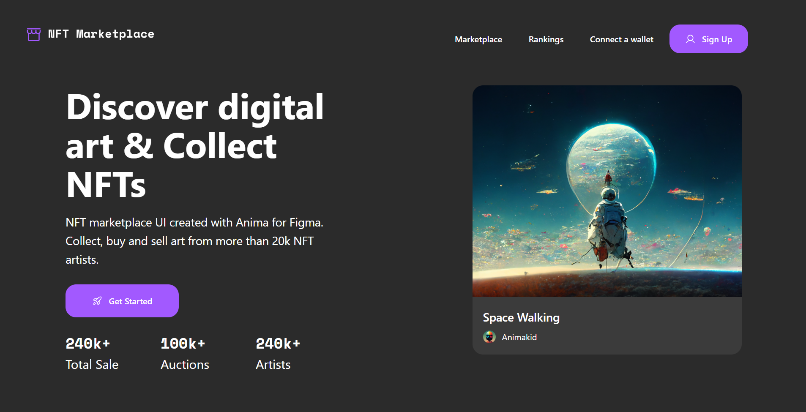

# 🎓 Web Design — Final Project

This is my **end-of-term project** for the Web Design course, completed under the supervision of **Mohammad Mahdi Hosseinzadeh**.

🔗 **Live Demo:** [nft-marketplace-8yuf.vercel.app](https://nft-marketplace-8yuf.vercel.app/)

---

## About

This project serves as the final assessment of the Web Design course, showcasing the skills acquired throughout the semester — including UI design, web page structuring, and delivering a proper user experience.

---

## Preview

[](https://nft-marketplace-8yuf.vercel.app/)

> Click the image to visit the live site.

---

## Getting Started

```bash
# Clone the repository
git clone https://github.com/Aryanpml/NFT-Marketplace.git

# Navigate to the project folder
cd NFT-Marketplace

# Open in browser
open index.html
```

---

Made with ❤️ for MFT Design class
